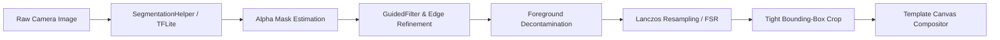

# 📸 ST24-ProductPhoto

<p align="center">
  
  
  
  
  
</p>

<p align="center">
  <b>🌐 Language / Язык:</b><br/>
  <b>English</b> | <a href="README.ru.md"><b>Русский</b></a>
</p>

---

## 🌟 Overview

**ST24-ProductPhoto** is a high-performance Android application designed for e-commerce sellers, retailers, and photographers. It automates product photography workflows by providing instant, **on-device AI background segmentation**, high-fidelity matting, super-resolution filtering, and customizable commercial banner generation (with dynamic QR codes, price tags, and contact information).

---

## ✨ Key Features

- **🤖 On-Device AI Background Removal**
  - Instant offline inference using quantized [U2-Net FP16 TFLite](app/src/main/assets/u2net_fp16.tflite).
  - High-precision edge refinement with [Guided Filter](app/src/main/java/com/example/mlkit/GuidedFilter.kt) and [Deep Image Matting](app/src/main/java/com/example/mlkit/DeepImageMattingHelper.kt).
  - High-quality edge smoothing and upscaling via [Lanczos Filtering](app/src/main/java/com/example/utils/LanczosHelper.kt) and [FSR Super-Resolution](app/src/main/java/com/example/mlkit/FsrSuperResolution.kt).
  - Automatic tight bounding-box calculation and optical centering algorithms.

- **🎨 Commercial Card & Banner Compositor**
  - Multiple professional branding templates (Clean Modern, Minimalist, Dark Studio, Tech Gradient, Custom Colors).
  - **Dynamic QR Code Generation** via [QrCodeHelper](app/src/main/java/com/example/utils/QrCodeHelper.kt) linking directly to item pages or web storefronts.
  - **CSS Flexbox-Engineered Layout**: Pixel-perfect typography and symmetric vertical centering for product titles, price badges, and contact phone numbers.
  - Interactive multi-touch canvas: drag, scale, rotate, and soft drop-shadow adjustments.

- **📷 Pro Camera & Studio Controls**
  - Integrated [CameraX Screen](app/src/main/java/com/example/ui/camera/CameraScreen.kt) with grid overlays, flash toggle, and tap-to-focus.
  - Direct import from system gallery or instant camera snapshot.

- **💾 Local Persistence & Gallery**
  - Offline-first [Room Database](app/src/main/java/com/example/data/AppDatabase.kt) storing processed items, metadata, and high-resolution exports.
  - Integrated [Gallery Viewer](app/src/main/java/com/example/ui/gallery/GalleryScreen.kt) with instant sharing, re-editing, and deletion.

---

## 🏗️ Architecture & Project Structure

The project follows modern Android **MVVM (Model-View-ViewModel)** guidelines with Clean Architecture separation:

```
ST24-ProductPhoto/
├── app/
│   ├── src/main/
│   │   ├── assets/
│   │   │   └── u2net_fp16.tflite                # Pre-trained on-device AI Segmentation Model
│   │   ├── java/com/example/
│   │   │   ├── MainActivity.kt                  # Root Activity & Type-Safe Compose Navigation
│   │   │   ├── ProductApplication.kt            # Application Class & Dependency Provisioning
│   │   │   ├── data/                            # Persistence & Data Layer (Room)
│   │   │   │   ├── AppDatabase.kt               # Room Database Configuration
│   │   │   │   ├── ProductDao.kt                # Data Access Object (CRUD Operations)
│   │   │   │   ├── ProductEntity.kt             # Room Data Schema
│   │   │   │   └── ProductRepository.kt         # Single Source of Truth Repository
│   │   │   ├── mlkit/                           # AI, Matting & Image Processing Pipeline
│   │   │   │   ├── SegmentationHelper.kt        # TFLite Inference & Bounding-Box Detection
│   │   │   │   ├── DeepImageMattingHelper.kt    # Tri-map Generation & Alpha Matting
│   │   │   │   ├── GuidedFilter.kt              # Edge-Preserving Guided Filter
│   │   │   │   ├── FsrSuperResolution.kt        # Fast Super-Resolution Upscaling
│   │   │   │   ├── ForegroundEstimator.kt       # Color Reconstruction & Defringing
│   │   │   │   └── PipelineHelper.kt            # High-Level Orchestrator for Pipeline Stages
│   │   │   ├── ui/                              # Presentation Layer (Jetpack Compose M3)
│   │   │   │   ├── camera/
│   │   │   │   │   └── CameraScreen.kt          # CameraX Capture & Image Picker
│   │   │   │   ├── editor/
│   │   │   │   │   ├── EditorScreen.kt          # Canvas Editor UI & Styling Controls
│   │   │   │   │   └── EditorViewModel.kt       # State Machine, Layout Math & Rendering Canvas
│   │   │   │   ├── gallery/
│   │   │   │   │   ├── GalleryScreen.kt         # Saved Products Catalog
│   │   │   │   │   └── GalleryViewModel.kt      # Catalog State & Filtering
│   │   │   │   └── theme/                       # Material Design 3 Design System
│   │   │   │       ├── Color.kt                 # Color Palette
│   │   │   │       ├── Theme.kt                 # Dynamic Color Scheme
│   │   │   │       └── Type.kt                  # Typography Definitions
│   │   │   └── utils/                           # Core Utilities
│   │   │       ├── ImageEnhancer.kt             # Contrast, Brightness & Saturation
│   │   │       ├── LanczosHelper.kt             # High-Order Lanczos Resampling
│   │   │       └── QrCodeHelper.kt              # ZXing Vector/Bitmap QR Generator
│   │   └── res/                                 # App Resources, Vectors & Strings
│   └── build.gradle.kts                         # App-Level Gradle Build Configuration
├── build.gradle.kts                             # Project-Level Gradle Config
└── settings.gradle.kts                          # Project Modules & Repositories
```

---

## 🔬 AI & Image Processing Deep-Dive



1. **Inference**: [SegmentationHelper.kt](app/src/main/java/com/example/mlkit/SegmentationHelper.kt) executes U2-Net model with hardware acceleration (GPU / NNAPI delegates when available).
2. **Matting**: [GuidedFilter.kt](app/src/main/java/com/example/mlkit/GuidedFilter.kt) refines semi-transparent hair and complex edges against background spill.
3. **Bounding Box**: Analyzes alpha thresholds (`alpha > 10`) across projected scanlines to eliminate empty margins and identify the exact subject centroid.
4. **Composition**: [EditorViewModel.kt](app/src/main/java/com/example/ui/editor/EditorViewModel.kt) renders the final high-resolution raster template with exact font metrics and balanced margins.

---

## 🛠️ Tech Stack & Dependencies

- **Language:** [Kotlin 2.x](https://kotlinlang.org/)
- **UI Framework:** [Jetpack Compose](https://developer.android.com/jetpack/compose) with [Material Design 3](https://m3.material.io/)
- **AI & ML:**
  - [TensorFlow Lite](https://www.tensorflow.org/lite) (`org.tensorflow:tensorflow-lite`)
  - [TensorFlow Lite GPU Delegate](https://www.tensorflow.org/lite/performance/gpu)
- **Camera:** [CameraX](https://developer.android.com/training/camerax) (`camera-core`, `camera-camera2`, `camera-lifecycle`, `camera-view`)
- **Database:** [Room Database](https://developer.android.com/training/data-storage/room) with Kotlin Symbol Processing ([KSP](https://github.com/google/ksp))
- **Barcodes & QR:** [ZXing Core](https://github.com/zxing/zxing)
- **Concurrency:** Kotlin Coroutines & `StateFlow`
- **Testing:** [Robolectric](https://robolectric.org/) & [Roborazzi](https://github.com/takahirom/roborazzi) for unit and screenshot testing

---

## 🚀 Getting Started

### Prerequisites
- Android Studio Ladybug / Koala or newer
- JDK 17 or JDK 21
- Android Device or Emulator running Android 7.0 (API Level 24) or higher

### Building & Running
1. Clone the repository:
   ```bash
   git clone https://github.com/your-username/ST24-ProductPhoto.git
   cd ST24-ProductPhoto
   ```
2. Open the project in **Android Studio**.
3. Let Gradle sync dependencies.
4. Build the debug APK or run directly on device:
   ```bash
   ./gradlew assembleDebug
   ```
5. Run unit and UI tests:
   ```bash
   ./gradlew testDebugUnitTest
   ```

---

## 📄 License

This project is licensed under the **Apache License 2.0** — see the [LICENSE](LICENSE) file for details.

---

<p align="center">
  Developed with ❤️ for modern mobile e-commerce photography.
</p>
