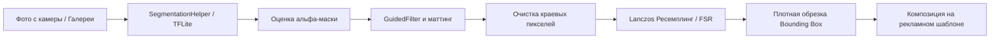

# 📸 ST24-ProductPhoto

<p align="center">
  
  
  
  
  
</p>

<p align="center">
  <b>🌐 Язык / Language:</b><br/>
  <a href="README.md"><b>English</b></a> | <b>Русский</b>
</p>

---

## 🌟 О проекте

**ST24-ProductPhoto** — это производительное Android-приложение для продавцов интернет-магазинов, маркетплейсов и фотографов. Приложение полностью автоматизирует процесс предметной фотосъемки: выполняет **мгновенное удаление фона с помощью встроенной нейросети прямо на устройстве**, применяет альфа-маттинг и суперразрешение, а также генерирует готовые рекламные карточки с динамическими QR-кодами, ценниками и контактными данными.

---

## ✨ Ключевые возможности

- **🤖 ИИ-сегментация и удаление фона на устройстве (Offline)**
  - Мгновенная локальная обработка через квантованную модель [U2-Net FP16 TFLite](app/src/main/assets/u2net_fp16.tflite).
  - Сверхточное сглаживание сложных краев с помощью [Guided Filter](app/src/main/java/com/example/mlkit/GuidedFilter.kt) и [Deep Image Matting](app/src/main/java/com/example/mlkit/DeepImageMattingHelper.kt).
  - Устранение цветовых ореолов и масштабирование высокого качества через [Lanczos-фильтрацию](app/src/main/java/com/example/utils/LanczosHelper.kt) и алгоритм [FSR Super-Resolution](app/src/main/java/com/example/mlkit/FsrSuperResolution.kt).
  - Автоматическое вычисление плотных границ объекта (`Bounding Box`) и идеальное оптическое центрирование.

- **🎨 Генератор коммерческих карточек и баннеров**
  - Разнообразные стили оформления (Clean Modern, Classic Minimal, Dark Tech, Brand Wall, кастомные фоны).
  - **Генерация динамических QR-кодов** с помощью [QrCodeHelper](app/src/main/java/com/example/utils/QrCodeHelper.kt) со ссылкой на товар, сайт или каталог.
  - **Верстка в стиле CSS Flexbox**: идеальные симметричные отступы, точный расчет метрик шрифта, вертикальное центрирование названия, цены и крупного номера телефона.
  - Интерактивное управление жестами: перемещение, масштабирование, вращение и настройка мягкой тени.

- **📷 Профессиональная камера**
  - Встроенный экран [CameraX](app/src/main/java/com/example/ui/camera/CameraScreen.kt) со вспомогательной сеткой, управлением вспышкой и фокусом по касанию.
  - Мгновенный импорт любого фото из системной галереи.

- **💾 Локальная база данных и галерея**
  - Автономная база данных [Room](app/src/main/java/com/example/data/AppDatabase.kt) для надежного сохранения готовых карточек, метаданных и истории.
  - Удобная [Галерея](app/src/main/java/com/example/ui/gallery/GalleryScreen.kt) с возможностью экспорта в PNG/JPEG, отправки через системный диалог Android и повторного редактирования.

---

## 🏗️ Архитектура и структура проекта

Проект разработан в строгом соответствии с рекомендациями Google по архитектуре Android (**MVVM + Clean Architecture**):

```
ST24-ProductPhoto/
├── app/
│   ├── src/main/
│   │   ├── assets/
│   │   │   └── u2net_fp16.tflite                # Локальная модель сегментации ИИ
│   │   ├── java/com/example/
│   │   │   ├── MainActivity.kt                  # Главная активность и Compose Navigation
│   │   │   ├── ProductApplication.kt            # Инициализация приложения и DI
│   │   │   ├── data/                            # Слой данных и сохранение (Room)
│   │   │   │   ├── AppDatabase.kt               # Конфигурация Room Database
│   │   │   │   ├── ProductDao.kt                # Data Access Object (CRUD-операции)
│   │   │   │   ├── ProductEntity.kt             # Схема сущности товара
│   │   │   │   └── ProductRepository.kt         # Репозиторий (Single Source of Truth)
│   │   │   ├── mlkit/                           # Пайплайн нейросетей и обработки графики
│   │   │   │   ├── SegmentationHelper.kt        # Инференс TFLite и поиск Bounding Box
│   │   │   │   ├── DeepImageMattingHelper.kt    # Генерация Tri-map и альфа-маттинг
│   │   │   │   ├── GuidedFilter.kt              # Направленный фильтр сглаживания краев
│   │   │   │   ├── FsrSuperResolution.kt        # Алгоритм быстрого суперразрешения
│   │   │   │   ├── ForegroundEstimator.kt       # Восстановление цвета и очистка фона
│   │   │   │   └── PipelineHelper.kt            # Оркестратор этапов обработки
│   │   │   ├── ui/                              # Слой интерфейса (Jetpack Compose M3)
│   │   │   │   ├── camera/
│   │   │   │   │   └── CameraScreen.kt          # Съемка через CameraX и выбор из галереи
│   │   │   │   ├── editor/
│   │   │   │   │   ├── EditorScreen.kt          # UI редактора карточки и настроек
│   │   │   │   │   └── EditorViewModel.kt       # Стейт-машина, верстка и рендеринг холста
│   │   │   │   ├── gallery/
│   │   │   │   │   ├── GalleryScreen.kt         # Галерея сохраненных товаров
│   │   │   │   │   └── GalleryViewModel.kt      # Состояние и фильтрация каталога
│   │   │   │   └── theme/                       # Дизайн-система Material Design 3
│   │   │   │       ├── Color.kt                 # Цветовая палитра
│   │   │   │       ├── Theme.kt                 # Динамическая тема оформления
│   │   │   │       └── Type.kt                  # Типографика
│   │   │   └── utils/                           # Вспомогательные утилиты
│   │   │       ├── ImageEnhancer.kt             # Коррекция контраста, яркости и насыщенности
│   │   │       ├── LanczosHelper.kt             # Высококачественный ресемплинг Ланцоша
│   │   │       └── QrCodeHelper.kt              # Генератор QR-кодов на базе ZXing
│   │   └── res/                                 # Ресурсы, векторные иконки, строки
│   └── build.gradle.kts                         # Конфигурация сборки модуля app
├── build.gradle.kts                             # Корневая конфигурация Gradle
└── settings.gradle.kts                          # Подключение модулей и репозиториев
```

---

## 🔬 Пайплайн обработки изображений и ИИ



1. **Инференс**: [SegmentationHelper.kt](app/src/main/java/com/example/mlkit/SegmentationHelper.kt) запускает модель U2-Net с аппаратным ускорением GPU/NNAPI (при доступности).
2. **Маттинг**: [GuidedFilter.kt](app/src/main/java/com/example/mlkit/GuidedFilter.kt) сглаживает полупрозрачные детали и сложные контуры без размытия объекта.
3. **Определение центра**: Алгоритм сканирует альфа-канал (`alpha > 10`), находит реальные границы предмета и центрирует его в полезной области макета.
4. **Рендеринг карточки**: [EditorViewModel.kt](app/src/main/java/com/example/ui/editor/EditorViewModel.kt) генерирует итоговый растровый баннер высокого разрешения с идеально рассчитанными отступами и типографикой.

---

## 🛠️ Стек технологий

- **Язык разработки:** [Kotlin 2.x](https://kotlinlang.org/)
- **UI Фреймворк:** [Jetpack Compose](https://developer.android.com/jetpack/compose) с [Material Design 3](https://m3.material.io/)
- **ИИ и Машинное Обучение:**
  - [TensorFlow Lite](https://www.tensorflow.org/lite) (`org.tensorflow:tensorflow-lite`)
  - [TensorFlow Lite GPU Delegate](https://www.tensorflow.org/lite/performance/gpu)
- **Работа с камерой:** [CameraX](https://developer.android.com/training/camerax) (`camera-core`, `camera-camera2`, `camera-lifecycle`, `camera-view`)
- **База данных:** [Room Database](https://developer.android.com/training/data-storage/room) с кодогенерацией через [KSP](https://github.com/google/ksp)
- **Генерация QR-кодов:** [ZXing Core](https://github.com/zxing/zxing)
- **Асинхронность:** Kotlin Coroutines & `StateFlow`
- **Тестирование:** [Robolectric](https://robolectric.org/) и [Roborazzi](https://github.com/takahirom/roborazzi) для модульных и скриншот-тестов

---

## 🚀 Установка и запуск

### Требования
- Android Studio Ladybug / Koala или новее
- JDK 17 или JDK 21
- Устройство или эмулятор с версией Android 7.0 (API Level 24) или выше

### Сборка проекта
1. Клонируйте репозиторий:
   ```bash
   git clone https://github.com/your-username/ST24-ProductPhoto.git
   cd ST24-ProductPhoto
   ```
2. Откройте проект в **Android Studio**.
3. Дождитесь синхронизации Gradle.
4. Соберите Debug APK или запустите приложение на устройстве:
   ```bash
   ./gradlew assembleDebug
   ```
5. Запуск юнит-тестов:
   ```bash
   ./gradlew testDebugUnitTest
   ```

---

## 📄 Лицензия

Проект распространяется под лицензией **Apache License 2.0** — подробности в файле [LICENSE](LICENSE).

---

<p align="center">
  Сделано с ❤️ для современной мобильной коммерческой фотографии.
</p>
